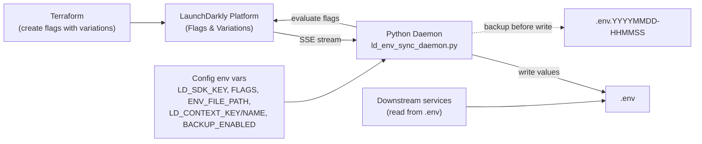
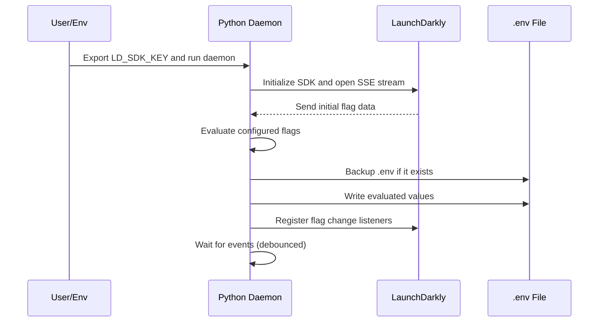
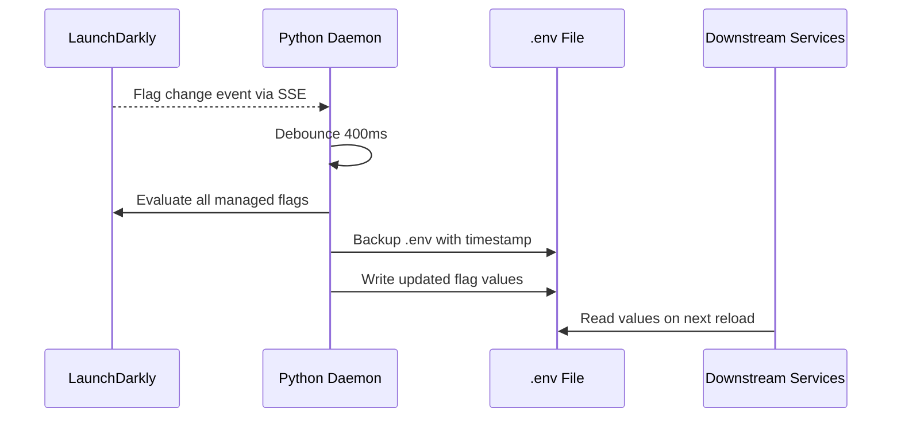

# LaunchDarkly → .env Sync Daemon (Python)

The Python Daemon runs in the background, listens for flag changes in real time, and automatically syncs them into a .env file. Each feature flag becomes an environment variable, backups are created before updates, and changes are applied instantly — giving teams dynamic, safe, and versioned configuration without redeploys.

### Technical details
The LaunchDarkly Python Daemon is a lightweight background service that keeps application configuration in sync with LaunchDarkly feature flags — without requiring manual updates or redeploys.

Once running, the daemon:
- Connects to LaunchDarkly using the Python server-side SDK and listens for real-time flag updates via SSE (Server-Sent Events).
- Synchronizes feature flags into a .env file, with each flag written as an environment variable that matches its flag name.
- Supports multiple variations per flag (e.g., default, v1, v2), allowing different environments or rollout stages to map cleanly into the .env configuration.
- Automatically backs up existing .env files before applying changes, appending a timestamp so prior configurations are preserved for traceability and rollback.
- Updates the .env file with new values immediately when flags are toggled, rules change, or variation values are modified.

In the sample implementation, the daemon manages three feature flags, each with three variations containing mock URLs. This provides a working example of how service endpoints or runtime settings can be dynamically controlled through LaunchDarkly.

Ultimately, this daemon acts as a bridge between LaunchDarkly and your application runtime, ensuring that configuration changes flow seamlessly and safely into your environment variables.

## Requirements

- Python 3.9+
- Install deps: `pip install -r requirements.txt`

## Configuration (environment variables)

- `LD_SDK_KEY` (required): LaunchDarkly server-side SDK key
- `FLAGS` (optional): Comma-separated flag keys; default: `SAMPLE_API_URL,SAMPLE_SERVICE_URL,SAMPLE_APP_URL`
- `ENV_FILE_PATH` (optional): Path to `.env`; default: `.env`
- `BACKUP_ENABLED` (optional): `true`/`false`; default: `true`
- `LOG_LEVEL` (optional): `DEBUG|INFO|WARNING|ERROR|CRITICAL`; default: `INFO`
- `DEBOUNCE_MS` (optional): Debounce milliseconds for rapid updates; default: `400`
- `LD_CONTEXT_KEY` (optional): Evaluation context key; default: `sample-daemon`
- `LD_CONTEXT_NAME` (optional): Evaluation context name; default: `Daemon`

## Run

```bash
export LD_SDK_KEY=YOUR_SERVER_SDK_KEY
python ld_env_sync_daemon.py
```

The daemon will:
- Initialize LaunchDarkly SDK and await initial data
- Perform initial evaluation of configured flags and write to `.env`
- Listen for flag changes and update `.env` after creating a timestamped backup

## Provision flags (Terraform)

This repo includes Terraform to create the three flags the daemon expects, with string variations and mock URLs:

- `SAMPLE_API_URL`
  - API v2 → `https://api-v2.example.com`
  - API v1 → `https://api-v1.example.com`
  - fallback API → `https://api-default.example.com`
- `SAMPLE_SERVICE_URL`
  - SAMPLE_APP_URL v2 → `https://app-api-v2.example.com`
  - SAMPLE_APP_URL v1 → `https://app-api-v1.example.com`
  - SAMPLE_APP_URL Base → `https://app-api.example.com`
- `SAMPLE_APP_URL`
  - SAMPLE_APP_URL v2 → `https://app-api-v2.example.com`
  - SAMPLE_APP_URL v1 → `https://app-api-v1.example.com`
  - SAMPLE_APP_URL Base → `https://app-api.example.com`

Apply:

```bash
cd terraform
terraform init
terraform apply \
  -var launchdarkly_access_token=YOUR_LD_API_TOKEN \
  -var project_key=YOUR_PROJECT_KEY \
  -var environment_key=YOUR_ENV_KEY
```

## Notes

- Env var names match flag keys 1:1. Values are written as strings.
- File permissions for `.env` are set to owner read/write (0600) where supported.
- If a flag is missing or wrong type, an empty string is written and a warning is logged.

### Troubleshooting

- Empty values in `.env` usually mean the flags don’t exist (or are not string-typed) in the LaunchDarkly project/environment for your `LD_SDK_KEY`. Create them with Terraform, then the daemon will update `.env` within a second of the SSE update.

## Architecture



### Startup flow



### Flag change flow




